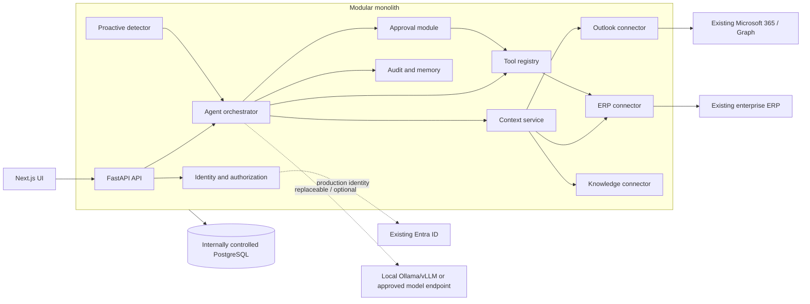
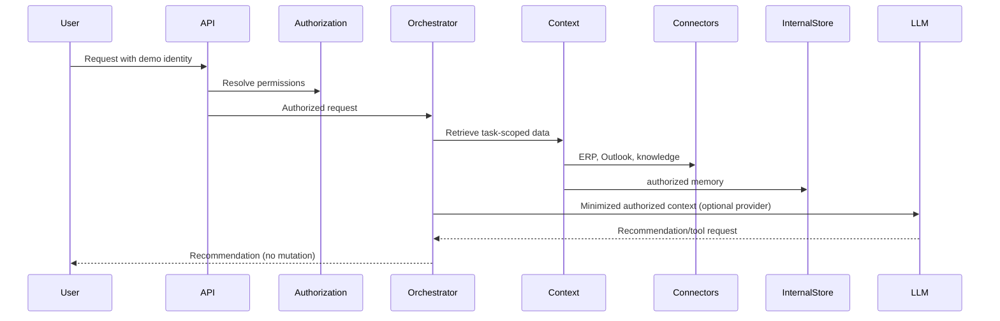
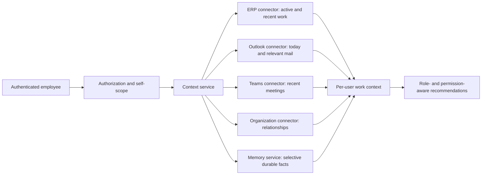
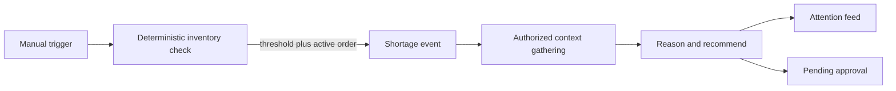
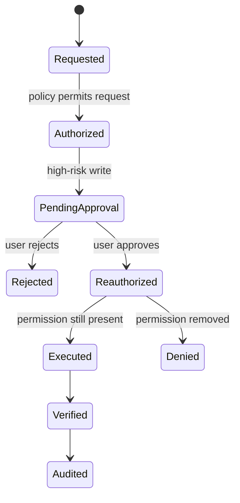
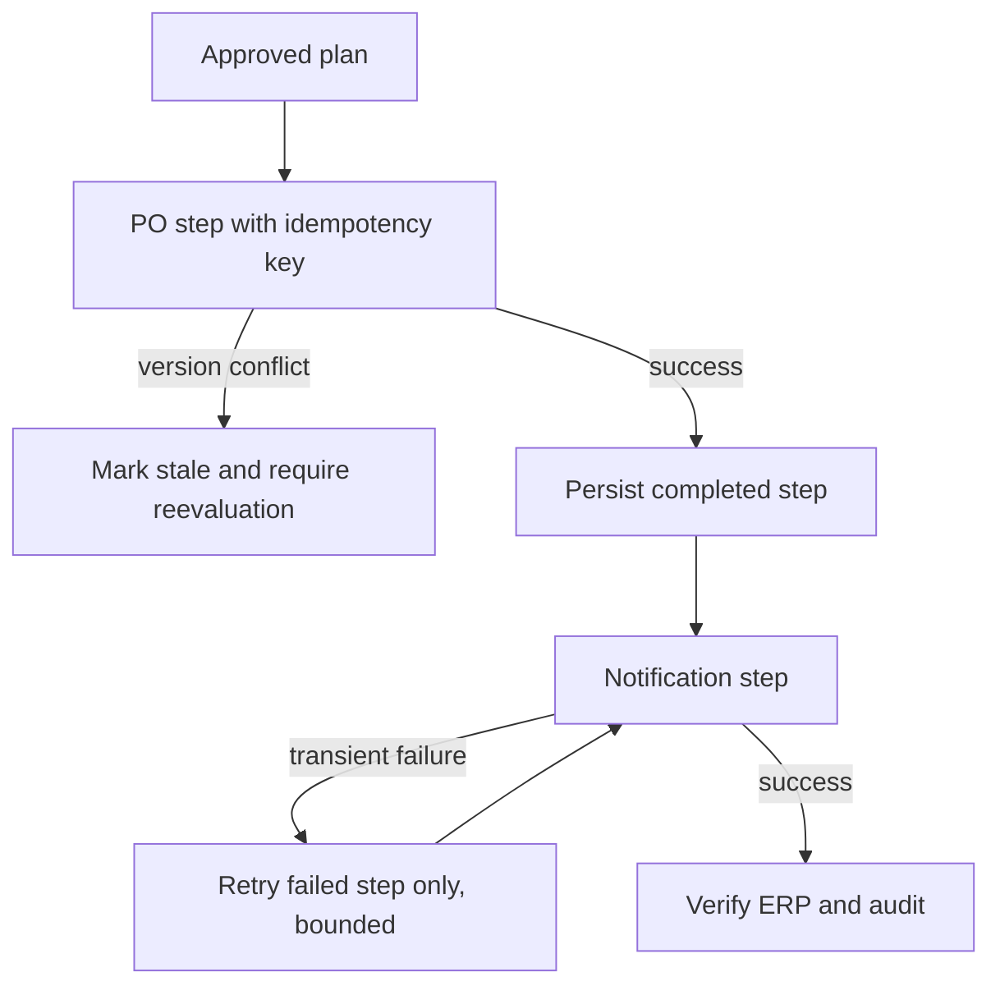

# System design

## Overall architecture

The POC is a modular monolith: one backend process and database, with boundaries expressed as Python modules and interfaces. The goal is to keep sensitive agent capabilities internally controlled, not to recreate every enterprise or commodity capability. Connectors allow existing enterprise systems and carefully selected external services to remain outside the agent trust boundary without coupling them to orchestration logic.

## Infrastructure ownership and delegation register

The category describes who controls the running capability and its data boundary; it does not imply that every underlying library was authored internally. FastAPI and PostgreSQL are open-source dependencies, for example, but their deployments and data remain under company control.

| Capability or dependency | Category | Why this category / delegation rationale | Data crossing the boundary | Security and privacy implications | Coupling |
|---|---|---|---|---|---|
| Agent orchestration, plan state, context selection, and proactive rules | **In-house** | These encode company workflows and determine what the model may see or request. Delegating them would surrender core policy and explainability. | None outside the internally controlled application except through an approved connector. | Contains task context and business logic; access must be restricted and audited. | Core domain code; no external agent framework dependency. |
| Authorization, permission policy, human approval, and tool registry | **In-house** | These are security controls and must remain deterministic and independent of any model or vendor. | Identity claims enter from the identity adapter; authorization decisions do not leave. | Compromise could permit unauthorized reads or mutations. Deny-by-default checks and execution-time reauthorization are mandatory. | Core interfaces are internal; identity providers and tools plug into them. |
| Memory, audit records, idempotency records, and workflow steps | **In-house** | They contain sensitive employee context, decisions, and recovery state and are needed for governance. | No data leaves unless an explicitly approved reporting/observability adapter is added. | Requires encryption, retention, access control, and audit-access policy in production. | Stored through the internal persistence layer. |
| PostgreSQL primary persistence | **In-house** | A self-hosted relational database is sufficient and keeps primary agent data under company operational control. Building a database would add risk without business value. | Application records remain inside the controlled deployment. | Database credentials, backups, encryption, network isolation, and retention are company responsibilities. | SQLAlchemy isolates most database mechanics; PostgreSQL semantics such as transactions and concurrency are intentional dependencies. |
| FastAPI, SQLAlchemy, Next.js/React, and Python/Node runtimes | **In-house** | These are commodity open-source building blocks run in the company environment. We reuse maintained frameworks instead of building web servers, ORMs, and UI runtimes. | No data crosses an external service boundary merely by using these libraries. | Supply-chain scanning, pinned versions, patching, and artifact provenance are required. | Framework coupling exists at API/UI edges but business policies and connectors remain application-owned. |
| Docker/Compose deployment runtime | **In-house** | Self-hosted packaging provides a reproducible POC without delegating runtime or data custody. | No application data crosses an external boundary during runtime; image pulls expose ordinary registry metadata during build. | Images must be pinned/scanned and production registries controlled. Docker Desktop is a developer convenience, not a production requirement. | Containers are packaging; the application can run on another internal orchestrator. |
| ERP | **Existing enterprise system** | The ERP already owns inventory, suppliers, purchase orders, and production orders. Recreating it would create a conflicting source of truth. | Only task-relevant authorized ERP records cross through the connector; approved mutations and idempotency/version metadata return to the ERP. | Use service/delegated credentials with least privilege, field filtering, TLS, and ERP-native audit controls. | Low domain coupling through `ERPConnector`; ERP-specific protocols stay in its adapter. |
| Microsoft Outlook / Microsoft Graph | **Existing enterprise system** | Mail and calendar already live in Microsoft 365. The agent should integrate rather than duplicate mailboxes or calendars. | Scoped search queries, relevant message/calendar fields, drafts, and approved notifications. The connector must not bulk-copy mailboxes into agent memory. | Respect Graph delegated/application permissions, tenant boundaries, retention, and sensitivity labels; minimize message content sent onward. | Low coupling through `OutlookConnector`; Graph can replace the mock without changing orchestration. |
| Microsoft Entra ID | **Existing enterprise system** | Enterprise identity, MFA, lifecycle, and group management belong in the established identity provider. Building identity would be less secure and duplicative. | Signed identity claims and stable subject/group identifiers enter the authentication adapter; internal application permissions remain locally evaluated. | Validate issuer, audience, signature, tenant, token lifetime, and group/role mapping. Never treat a client-provided employee header as production identity. | Low coupling through the authentication adapter; authorization remains internal. |
| Internal policy and knowledge repositories | **Existing enterprise system** | Authoritative documents should remain in governed repositories rather than be recreated as agent-owned truth. | Task-relevant document excerpts and metadata cross the knowledge connector after access filtering. | Preserve document ACLs, classification, provenance, and deletion/retention obligations. | Low coupling through `KnowledgeConnector`; the POC uses seeded local documents. |
| Microsoft Teams | **Existing enterprise system** | Meeting and collaboration history already belongs to Microsoft 365 and should remain source-owned. | Only meetings involving the active employee and relevant summaries or decisions cross the connector for recent context. | Preserve membership, sensitivity labels, retention, and Graph permission boundaries; do not persist raw history as memory. | Low coupling through `TeamsConnector`; the POC uses seeded source rows. |
| Locally hosted Ollama/vLLM model endpoint | **In-house** | When selected, the model server runs inside the controlled environment; deterministic logic keeps the safety flow operational without it. We operate an existing model runtime rather than build an inference engine. | Minimized authorized context crosses an internal process boundary; never credentials, unrestricted enterprise data, or hidden policy state. | The model host still requires isolation, access control, retention-aware logging, and model supply-chain review. Outputs remain untrusted and cannot authorize or execute tools. | Optional and low coupling through `LLMProvider`; provider and model version are recorded for audit. |
| Approved externally hosted model endpoint | **Replaceable/optional external integration** | It may be delegated when model quality, specialized capability, capacity, or operating cost justifies it and company policy permits. The platform does not require it. | The same minimized authorized prompt/context as a local provider; sensitive fields should be redacted or withheld according to policy. | Requires contractual no-training/no-retention terms, regional processing controls, encryption, vendor risk review, and egress auditing. Some workloads may be prohibited entirely. | Low coupling through `LLMProvider`; removing it does not change tools, authorization, approval, memory, or persistence. |
| Enterprise broker or external observability platform | **Replaceable/optional external integration** | Not used by the POC. It should be delegated only when existing company infrastructure provides needed scale or operations more safely than a new internal component. | Broker: event IDs and minimum workflow payloads. Observability: operational metrics and redacted metadata, not prompts, email bodies, memory, or approval evidence by default. | Apply payload minimization, access controls, retention, regional routing, and vendor/tenant review. Sensitive audit remains in primary persistence. | Future adapter boundary only; no current runtime dependency. |
| Mandatory third-party SaaS infrastructure | **Externally delegated** | **None in the current POC.** This is a current design outcome, not a blanket prohibition. A future dependency belongs here only with a documented capability, risk, and cost justification. | Must be documented per integration before adoption. | Requires security, privacy, residency, retention, availability, and exit review. | Must use an adapter or infrastructure abstraction with an exit path. |

### Delegation rule

An external capability is acceptable when it provides a concrete advantage—such as access to an existing system of record, stronger managed identity, specialized model quality, or proven operational scale—and its data boundary is acceptable. Adoption requires an owner, least-privilege access, data minimization, auditability, failure behavior, and a documented replacement/exit path. Technology is not added solely to make the architecture appear more distributed.

Regardless of provider choices, agent orchestration, authorization, permission evaluation, human approvals, memory policy, audit evidence, tool execution policy, and primary agent persistence remain internally controlled.

## User-request data flow

## Per-user work-context assembly

Current and recent context is assembled on demand and retains source provenance. It is not automatically written to `memories`. The memory service returns only durable records explicitly seeded or saved through its selective write method. The API is self-scoped by default; requesting another employee's context is denied unless a future explicit `work_context.read_all` policy is granted.

## Proactive detection data flow

## Tool execution and approval

## Failure and retry

The current happy-path mock notification succeeds immediately. Step records and distinct idempotency keys provide the seam for bounded background retries without repeating the PO mutation.
