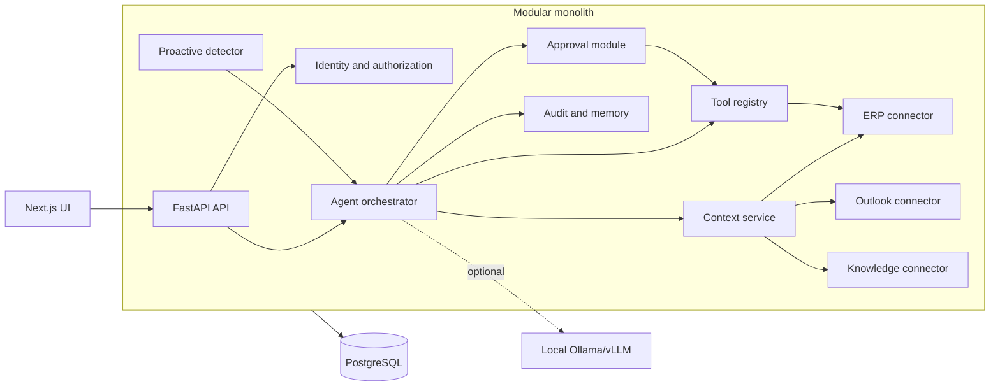
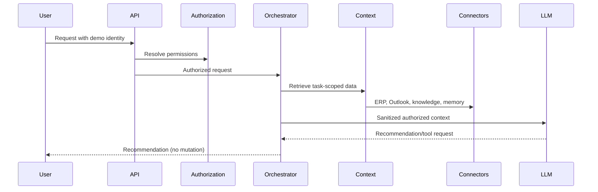
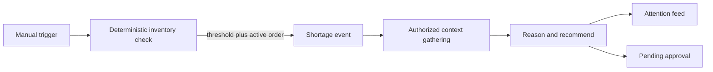
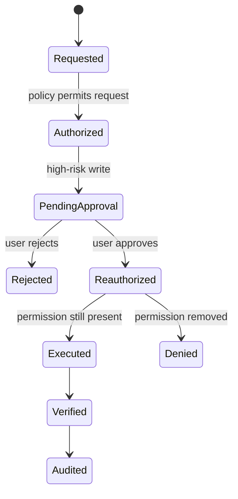
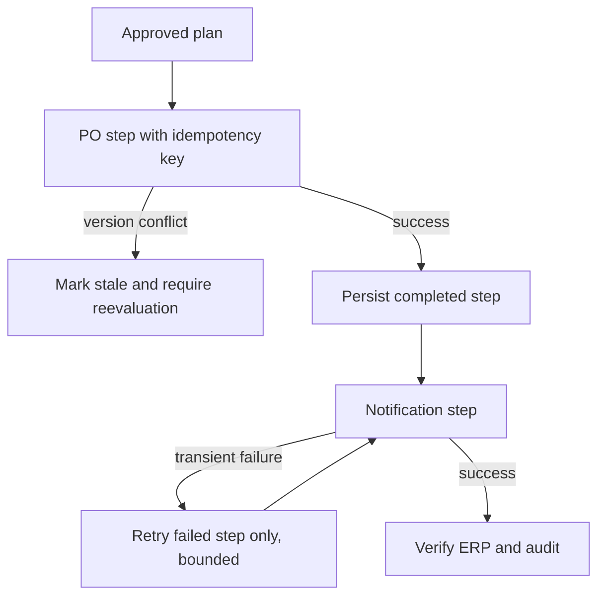

# System design

## Overall architecture

The POC is a modular monolith: one backend process and database, with boundaries expressed as Python modules and interfaces. Connectors can later move behind remote adapters without changing agent logic.

## User-request data flow

## Proactive detection data flow

## Tool execution and approval

## Failure and retry

The current happy-path mock notification succeeds immediately. Step records and distinct idempotency keys provide the seam for bounded background retries without repeating the PO mutation.

